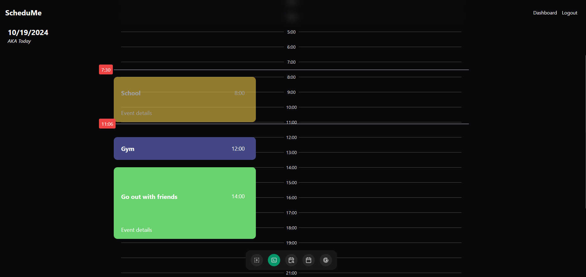
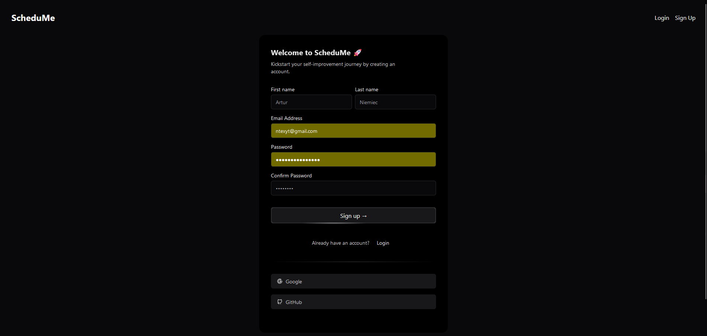

# ScheduMe ⏰

## Introduction 🌟

ScheduMe is an adaptable calendar app, that dynamically adjusts to your day.

## Key Features 🔑

- **Priority Manager**: Set your event priorities, and let us handle the rest—rearranging less important tasks to make room for top goals.
- **Time Block Flexibility**: Life happens—your schedule should understand that. Flexible time blocks let you handle unexpected events with ease.
- **Dynamic Day Planner**: Set your wake-up time, and we’ll adapt your entire day automatically—no more scrambling to catch up. Events move seamlessly to fit the rest of your day.
- **Google Calendar Integration**: Designed for easy switch.

## Tech used 🛠️

  

## Screenshots 🖼️

<table align="center">
  <tr>
    <td>
      
      
Your schedule

    </td>
    <td>
      
      
Creating events

    </td>
  </tr>
  <tr>
    <td>
      
      
Google Calendar Integration

    </td>
    <td>
      
      
Hero page

    </td>
  </tr>
</table>

## Author 💚
[Artur Niemiec](https://anindustries.tech/) - ([@MrNtex](https://www.github.com/MrNtex))
